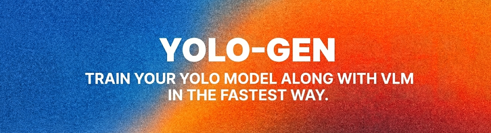

<p align="center">
  
</p>

# YoloGen

**Train YOLO + VLM with one command. No extra labeling.**

```
Image + YOLO labels → Auto-generate VLM training data → Fine-tuned model
```

Train object detection and a VLM "second opinion" from a standard YOLO dataset. VLM training data is auto-generated from YOLO labels — including **hard negatives** mined directly from your existing images, without running the detector.

## Use Cases

YOLO localizes objects (bbox) → VLM analyzes the red-boxed region and either **describes** or **verifies** it:

| Scenario | Descriptive Mode | Verification Mode |
|----------|------------------|-------------------|
| **Defect Detection** | `{"defect": true, "type": "scratch", "size": "2mm"}` | `Yes` / `No` |
| **Weapon Detection** | `{"weapon": true, "type": "rifle"}` | `Yes` / `No` |
| **Vehicle Damage** | `{"damaged": true, "part": "front bumper"}` | `Yes` / `No` |
| **Medical Imaging** | `{"finding": true, "type": "nodule", "size": "6mm"}` | `Yes` / `No` |

## Why YOLO + VLM?

- **YOLO alone**: Fast but not enough for production-level accuracy
- **VLM alone**: Smart but too slow for production
- **YOLO + VLM**: Fast detection + VLM adds detailed descriptions, classification, **and false positive filtering**

## Two VLM Training Modes

YoloGen supports two training modes for the VLM stage. Pick based on what your downstream system consumes.

### 1. Descriptive mode (default)

Template-based captioning. Given a red-boxed image, the VLM produces a human-readable description or structured JSON. Good when you need rich metadata per detection.

```yaml
vlm_dataset:
  qa_format: descriptive      # default
  prompts:
    - question: "What is in the red marked area?"
      answer:   "The red marked area contains a {class}. {detail}"
```

### 2. Verification mode (binary Yes/No)

Per-bbox Yes/No supervision. For every GT bbox and every class in your dataset, YoloGen emits one sample: matching class → `"Yes"`, other classes → `"No"`. Cross-class hard negatives are produced automatically.

```yaml
vlm_dataset:
  qa_format: binary_multiclass
  class_prompts:
    handgun: |
      Decide if the red bounding box contains a handgun.
      Answer Yes or No only.
    rifle: |
      Decide if the red bounding box contains a long gun (rifle or shotgun).
      Answer Yes or No only.
```

Verification mode is designed to pair with an existing detector: use YOLO to propose regions and the fine-tuned VLM to **reject false positives** at inference time.

## Hard Negative Mining — Detector-Free

Verification mode unlocks an additional step: **automated hard-negative generation** directly from your GT bboxes, with no detector run required.

```
GT bbox → ring-based candidate search → DINOv2 similarity filter → "No" samples
```

For each positive bbox, YoloGen scans concentric rings around it, embeds each candidate region with a pretrained self-supervised encoder (DINOv2 by default), and keeps the candidates whose similarity to the positive falls inside a configurable "hard negative" window (default `0.25–0.50`). These are **regions that look like a positive but are not**: exactly the kind of sample that trains a VLM to reject real-world detector FPs.

Multi-layer safeguards protect against true-positive leakage:

1. **IoU exclusion** against every GT bbox in the image (multi-object safe)
2. **Hard similarity cap** to reject candidates that may actually contain the target
3. **Diversity filter** across retained regions
4. *Optional:* zero-shot **VLM double-check** — ask a base VLM if the region contains the class; drop on "Yes"

Enable with a single config block:

```yaml
vlm_dataset:
  qa_format: binary_multiclass       # required
  class_prompts: { ... }             # one system prompt per class
  negative_mining:
    enabled: true
    embedding_model: facebook/dinov2-base
    rings: [3.0, 6.0]                # multiples of GT bbox min side
    similarity_range: [0.25, 0.50]
    max_per_image: 3
    exclude_iou_with_any_gt: 0.1
    diversity_iou_threshold: 0.3
    # optional 4th safeguard (slow, opt-in)
    vlm_verify:
      enabled: false
      model: Qwen/Qwen3-VL-4B-Instruct
```

The approach is **domain-agnostic**. The same config pattern works for weapons, defects, medical imaging, vehicle damage, or any detection task where "looks like but is not" is a meaningful concept.

## Built With

- [Ultralytics YOLOv8/v11](https://github.com/ultralytics/ultralytics) — state-of-the-art YOLO implementation
- [Qwen2.5-VL](https://huggingface.co/Qwen/Qwen2.5-VL-7B-Instruct) / [Qwen3-VL](https://huggingface.co/Qwen/Qwen3-VL-8B-Instruct) — vision-language models
- [PEFT / QLoRA](https://github.com/huggingface/peft) — parameter-efficient fine-tuning
- [DINOv2](https://github.com/facebookresearch/dinov2) — self-supervised vision features for hard negative mining

## Quick Start

### 1. Install

```bash
pip install -r requirements.txt
```

### 2. Prepare Dataset

Standard YOLO format:
```
data/my_dataset/
├── images/
│   ├── train/
│   └── val/
├── labels/
│   ├── train/
│   └── val/
└── dataset.yaml
```

Example `dataset.yaml`:
```yaml
path: .  # Dataset root (relative to this file)
train: images/train
val: images/val

names:
  0: class_a
  1: class_b
```

### 3. Configure

```bash
cp configs/default.yaml configs/my_run.yaml
# then edit `data:` inside my_run.yaml
```

`configs/default.yaml` is the single source of truth. Required fields
are uncommented; advanced features (verification mode, hard-negative
mining) live as commented-out blocks — uncomment to enable.

### 4. Train

```bash
python train.py --config configs/my_run.yaml
```

This will:
1. Train YOLO (100 epochs)
2. Generate VLM dataset (Q&A pairs with red boxes)
3. Train VLM with QLoRA (3 epochs)
4. Export ONNX
5. Generate visualizations

#### Skip flags

Run only part of the pipeline:

```bash
# VLM dataset only (no YOLO training, no VLM training)
python train.py --config configs/default.yaml --skip-yolo --skip-vlm-training

# YOLO only
python train.py --config configs/default.yaml  # with vlm.enabled: false in config

# Reuse an existing VLM dataset, retrain VLM
python train.py --config configs/default.yaml --skip-yolo --skip-vlm-data
```

### 5. Predict

```bash
# YOLO only
python predict.py --weights runs/exp_xxx/yolo/weights/best.pt --source image.jpg

# YOLO + VLM
python predict.py --weights runs/exp_xxx/yolo/weights/best.pt --source image.jpg \
    --vlm --vlm-adapter runs/exp_xxx/vlm/best
```

### 6. Evaluate (Compare Base vs Fine-tuned)

```bash
jupyter notebook examples/compare_vlm.ipynb
```

Compare your fine-tuned VLM against the base model to measure improvements.

### Python API

```python
from yologen.core.predictor import YOLOPredictor, VLMPredictor, UnifiedPredictor

# YOLO only
yolo = YOLOPredictor(weights="best.pt")
results = yolo.predict("image.jpg")

# VLM only (for images with existing bounding boxes)
vlm = VLMPredictor(vlm_adapter="vlm/best")
answer = vlm.predict(image="image.jpg", bbox=[100, 100, 300, 300], question="What is this?")

# YOLO + VLM combined
predictor = UnifiedPredictor(yolo_weights="best.pt", vlm_adapter="vlm/best")
results = predictor.predict(source="image.jpg", vlm_question="What is in the red box?")
```

**Verification mode** (adapters trained with `qa_format: binary_multiclass`):

```python
# Adapter metadata (class_prompts, qa_format) is auto-loaded from
# the adapter's config.json when the predictor is constructed.
vlm = VLMPredictor(vlm_adapter="runs/exp_xxx/vlm/best")

# Ask the model about one class
result = vlm.verify(
    image="frame.jpg",
    bbox=[120, 340, 280, 520],
    target_class="handgun",
)
# → {"label": "Yes" | "No" | "unknown", "raw": "...", "target": "handgun"}

# Or run every class the adapter knows about in one call
all_results = vlm.verify_all(image="frame.jpg", bbox=[120, 340, 280, 520])
```

**Hard negative mining** — standalone use of the miner:

```python
from PIL import Image
from yologen.data import NegativeMiner, GTBox

miner = NegativeMiner({
    "enabled": True,
    "embedding_model": "facebook/dinov2-base",
    "rings": [3.0, 6.0],
    "similarity_range": [0.25, 0.50],
    "max_per_image": 3,
})

image = Image.open("frame.jpg")
gt_boxes = [GTBox(bbox=(900, 605, 987, 664), class_id=0, class_name="handgun")]

regions = miner.mine_image(image, gt_boxes)
for r in regions:
    print(r.bbox, r.similarity, r.ring_idx, r.source_gt_class)
```

The miner's full-dataset entry point, `mine_dataset(pairs)`, returns
mined regions plus aggregate `MiningStats`, which is what the
YAML-driven pipeline uses internally.

## Configuration

Copy and edit `configs/default.yaml`. Two representative setups:

### A. Descriptive mode (default)

```yaml
yolo:
  model: yolov8n.pt
  epochs: 100
  batch: 16

vlm:
  enabled: true
  model: Qwen/Qwen3-VL-4B-Instruct     # 2B / 4B / 8B available
  epochs: 3
  precision: 4bit

vlm_dataset:
  qa_format: descriptive               # default
  box_color: [0, 0, 255]               # BGR red
  box_thickness: 3
  system_prompt: |
    You are an object detection assistant.
    Identify objects in red marked areas clearly.
  prompts:
    - question: "What is in the red marked area?"
      answer:   "The red marked area contains a {class}. {detail}"
```

### B. Verification mode + hard negative mining

```yaml
yolo:
  model: yolov8m.pt
  epochs: 150

vlm:
  enabled: true
  model: Qwen/Qwen3-VL-4B-Instruct
  epochs: 2
  precision: 4bit

vlm_dataset:
  qa_format: binary_multiclass
  box_color: [0, 0, 255]
  box_thickness: 3

  class_prompts:
    handgun: |
      You are a security analyst reviewing weapon-detection alerts.
      Decide if the red bounding box contains a handgun.
      Answer Yes or No only.
    rifle: |
      You are a security analyst reviewing weapon-detection alerts.
      Decide if the red bounding box contains a long gun (rifle or shotgun).
      Answer Yes or No only.

  negative_mining:
    enabled: true
    embedding_model: facebook/dinov2-base
    rings: [3.0, 6.0]
    similarity_range: [0.25, 0.50]
    max_per_image: 3
```

See [`configs/default.yaml`](configs/default.yaml) for every available field.

## Output Structure

```
runs/exp_20251217_xxx/
├── yolo/
│   └── weights/
│       ├── best.pt           # YOLO model
│       └── best.onnx         # ONNX export
├── vlm/
│   └── best/                 # VLM adapter (~150MB)
└── visualizations/
    ├── training_curves.png
    └── prediction_samples.png
```

## Key Features

| Feature | Description |
|---------|-------------|
| Single Config | One YAML controls everything |
| Sequential Training | YOLO → VLM automatically |
| Two VLM Modes | Descriptive captioning or binary Yes/No verification |
| **Hard Negative Mining** | Detector-free, ring-based spatial + embedding-similarity generation of "No" samples. Domain-agnostic. |
| **Safeguarded Mining** | Multi-layer TP-leakage protection (IoU, similarity cap, diversity, optional VLM verify) |
| QLoRA | 4B / 7B / 8B VLM training with 4-bit quantization |
| Visual Grounding | Red boxes link detection to VLM |
| Skip Flags | `--skip-yolo`, `--skip-vlm-data`, `--skip-vlm-training` for modular runs |
| Configurable | Colors, prompts, models, mining parameters all in YAML |

## Requirements

- Python 3.10+

### GPU Memory Usage

| Task | VRAM |
|------|------|
| YOLO training | 4-12 GB |
| VLM 2B-3B | ~14-18 GB |
| VLM 4B | ~18-20 GB |
| VLM 7B-8B | ~24-28 GB |

*VLM memory depends on `max_pixels` setting. Values above are for 4-bit QLoRA with default pixel settings.*

## Example Results

**Input**: Product image from assembly line

**YOLO Output**:
```
[defect] conf=0.92 bbox=[120, 340, 280, 520]
```

**VLM Output**:
```json
{"defect": true, "type": "scratch", "size": "3mm"}
```

## FAQ

**Do I need to manually write VLM training data?**
No. YoloGen automatically generates Q&A pairs from your YOLO labels. Just prepare a standard YOLO format dataset.

**How many images do I need?**
Minimum ~100 images for YOLO, ~500+ recommended for better VLM results. Hard negative mining scales with dataset size — each positive bbox can contribute up to `max_per_image` "No" samples.

**Can I use only YOLO without VLM?**
Yes. Set `vlm.enabled: false` in config, or just use `predict.py` without `--vlm` flag.

**When should I use `binary_multiclass` mode?**
When your downstream system only needs `Yes / No` per class — for example, validating detector outputs to reduce false positives. The mode automatically emits cross-class negatives (Class A bbox asked as Class B → `"No"`), and it is a prerequisite for hard negative mining.

**What does hard negative mining actually do?**
For each GT bbox it finds image regions that look similar to the positive but do not contain any target, and labels them `"No"`. Unlike the classic "run the detector to collect FPs" loop, this requires no detector and no extra labeling. The defaults are tuned to DINOv2 (`similarity_range: [0.25, 0.50]`); swap the embedding model for other backbones.

**Will hard negative mining ever mislabel a real positive as `"No"`?**
Three safeguards are always active: (1) any candidate overlapping **any** GT bbox above `exclude_iou_with_any_gt` is dropped, (2) candidates above `similarity_range[1]` are dropped (they may be the target), (3) retained regions are deduplicated by IoU. A fourth safeguard — zero-shot VLM verification — is opt-in and runs a base VLM on each candidate, dropping anything it calls `"Yes"`. In practice, combining the first three gives TP-leakage rates well below 1% on typical datasets.

**How much VRAM do I need?**
See [GPU Memory Usage](#gpu-memory-usage) table above. RTX 4090 (24GB) can train both 3B and 7B models with default settings. Hard negative mining with DINOv2-base needs only ~1 GB extra and runs on CPU / MPS / CUDA.

**How do I customize VLM responses?**
In descriptive mode, edit `system_prompt`, `prompts`, and `details` under `vlm_dataset`. In `binary_multiclass` mode, edit `class_prompts` (one system prompt per class) and optionally `class_questions`.

## License

MIT

Note: This project uses [Ultralytics](https://github.com/ultralytics/ultralytics) which is licensed under AGPL-3.0. See their license for details.
